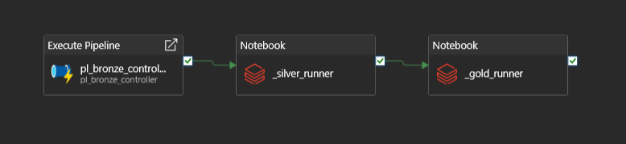

# 📊 Olist Azure Lakehouse – End-to-End Data Engineering Project 

🔹 Project Overview

This project implements a production-style Azure Lakehouse architecture using the Brazilian E-Commerce Public Dataset by Olist.
It demonstrates end-to-end data engineering: ingestion, transformation, orchestration, dimensional modeling, and analytics.

The pipeline follows modern Bronze → Silver → Gold design principles and exposes analytics through Power BI via Databricks SQL Warehouse.

Goal: Build an industry-grade, scalable analytics pipeline using Azure-native services.

---
🧰 Technology Stack

| Layer            | Technology                             |
| ---------------- | -------------------------------------- |
| Storage          | Azure Data Lake Storage Gen2           |
| Orchestration    | Azure Data Factory                     |
| Processing       | Azure Databricks (PySpark, Delta Lake) |
| Analytics Engine | Databricks SQL Warehouse               |
| BI & Reporting   | Power BI                               |
| Dataset          | Olist Brazilian E-Commerce (Kaggle)    |

---
🏗️ Logical Architecture


**Design Pattern:** Medallion Architecture (Bronze → Silver → Gold)  

---
📦 Dataset

Source:
Brazilian E-Commerce Public Dataset by Olist
https://www.kaggle.com/datasets/olistbr/brazilian-ecommerce

Key entities:
- Customers
- Orders
- Order Items
- Products
- Sellers
- Payments
- Reviews
- Geolocation

---
🔄End-to-End Data Flow

1. ADF orchestrates ingestion using a config-driven pipeline
2. Raw CSV files land in Bronze (ADLS Gen2)
3. Databricks Silver:
   - Enforces schemas
   - Removes duplicates
   - Adds metadata
   - Uses Delta MERGE for idempotent updates
4. Databricks Gold:
   - Builds star schema (facts & dimensions)
   - Applies business rules and metrics
5. Power BI connects via Databricks SQL Warehouse

---
🥉 Bronze Layer – Raw Ingestion

Characteristics
 - Immutable raw data
 - CSV format
 - Partitioned by ingestion date
 - No transformations

ADLS Container Structure
```text
olist/
└── bronze/
    ├── customers/
        ├── ingest_date=2026-01-03/
        └── ingest_date=2026-01-04/
    ├── geolocation/
    ├── order_items/
    ├── order_payments/
    ├── order_reviews/
    ├── orders/
    ├── payments/
    ├── products/
    └── sellers/
```

---
🥈 Silver Layer – Cleansed & Conformed

Key Features
- Schema enforcement per table
- Business key deduplication
- Data quality checks
- Metadata columns:
  - _silver_load_ts
  - _ingest_ts
  - _silver_source
  - _source
- Delta MERGE (not overwrite) for industry-grade upserts

Example Responsibilities
- One row per natural business key
- Cleaned categorical values
- Join-safe dimensions
  
---
🥇 Gold Layer – Dimensional Model
 
 Star Schema
 
 Dimensions
  - dim_customers
  - dim_products
  - dim_product_category
  - dim_sellers
  - dim_geolocation
  - dim_date
    
 Facts
  - fact_orders
  - fact_order_items

Grain Validation
- Facts validated at order and order-item level
- All foreign keys enforced
- No null business keys allowed

---
⏱️ Orchestration (ADF)

Pipelines
- pl_bronze_ingest
- pl_bronze_controller
- pl_e2e_controller

Design Highlights
- Lookup + ForEach for dataset-driven ingestion
- Parameterised source/sink paths
- End-to-end control pipeline:



---
📊 Analytics & Power BI
Connection

- Databricks SQL Warehouse
- AAD/OAuth authentication
- No direct ADLS access (best practice)

Power BI Model
- Proper star schema
- Single-direction filters
- Measures layer separated


The Power BI semantic model follows a strict star schema with single-direction filtering to ensure predictable aggregation behavior and optimal performance.

Dashboard KPIs
- Total Orders
- Total Revenue
- Average Order Value
- Distinct Customers
- Product category performance
- Geographic distribution

---
🧪 Data Quality & Validation

Implemented across Silver & Gold:
- Null business key checks
- Duplicate detection
- Negative monetary value checks
- Grain enforcement assertions

Pipelines fail fast on data quality violations.

---
▶️ How to Run

1. Upload dataset to ADLS (or use Kaggle source)
2. Configure ADF linked services
3. Run pl_e2e_controller pipeline
4. Execute Silver & Gold notebooks
5. Refresh Power BI dataset

---
🧠 Key Design Decisions

- MERGE instead of overwrite for Silver → idempotency
- SQL Warehouse for Power BI → semantic layer separation
- Config-driven ingestion → scalable dataset onboarding
- Star schema → analytics-first design
